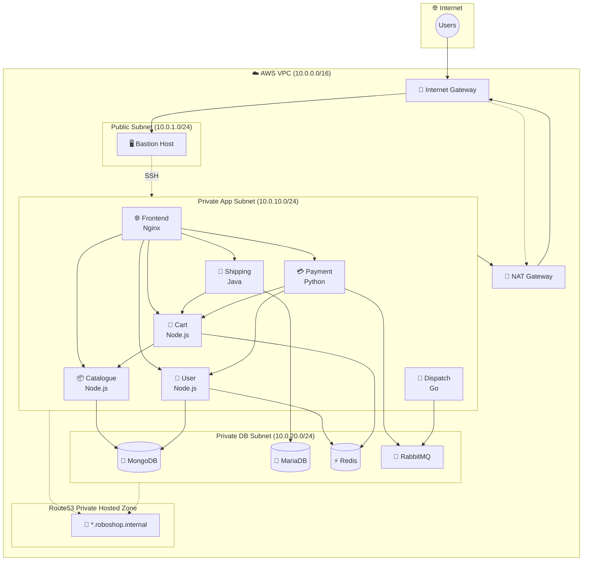
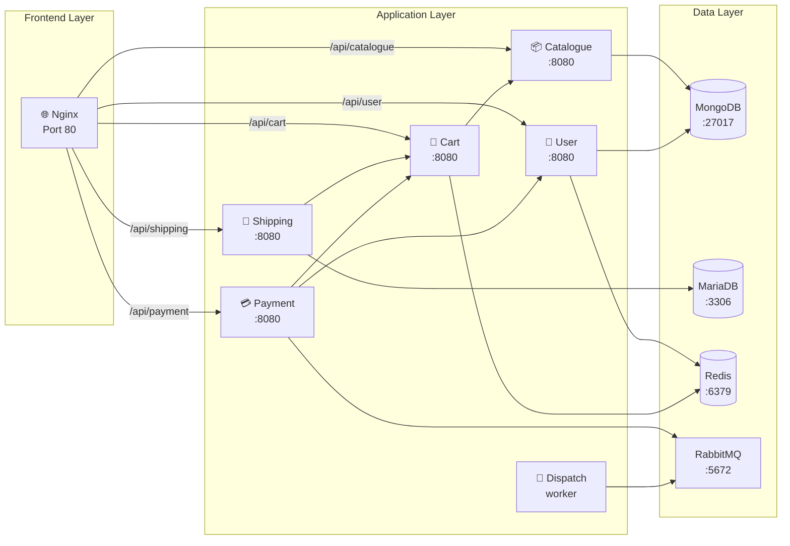
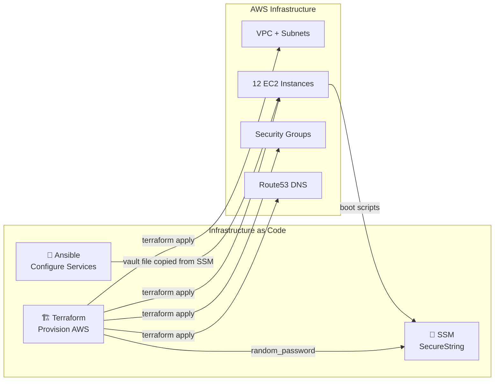

<div id="top" align="center">

</div>

# RoboShop E-Commerce Platform - AWS Deployment

<div align="center">


[](https://github.com/lloredia/RoboShop/actions/workflows/ci.yml)
[](https://github.com/lloredia/RoboShop/commits/master)
[](https://github.com/lloredia/RoboShop/issues)
[](https://github.com/lloredia/RoboShop/stargazers)
[](https://github.com/lloredia/RoboShop/network/members)

**A microservices e-commerce platform on AWS, provisioned with Terraform and configured with Ansible**

</div>

---

## 🏗️ Architecture Overview



### Service Communication Flow



Dispatch does not listen for HTTP. It consumes the `orders` queue that payment publishes.

### Deployment Pipeline



## Table of Contents

- [Features](#features)
- [Quick Start](#quick-start)
- [Project Structure](#project-structure)
- [Security](#security)
- [Cost](#cost)
- [What I'd do next](#what-id-do-next)

## ✨ Features

### Infrastructure
- VPC with one public subnet and two private subnets, a single NAT gateway, and a bastion
- Route53 private zone for service discovery (`mongodb.roboshop.internal` and the rest)
- One security group per service. SSH reaches the bastion only, and only from `admin_cidr`
- IMDSv2, encrypted EBS, and a customer-managed KMS key for SSM parameters

### Microservices
- **Frontend** - Nginx reverse proxy
- **Catalogue** - Node.js, MongoDB
- **User** - Node.js, MongoDB and Redis
- **Cart** - Node.js, Redis and Catalogue
- **Shipping** - Java, MariaDB and Cart
- **Payment** - Python, User, Cart, and RabbitMQ
- **Dispatch** - Go worker, RabbitMQ

### Data
- MongoDB for catalogue and user documents
- MariaDB for the shipping `cities` database
- Redis for user and cart
- RabbitMQ for the payment to dispatch queue

This stack is **12 EC2 instances**: the bastion, four data nodes, and seven application nodes. Route53 has **11** private A records (the bastion is not in the private zone).

## 🚀 Quick Start

### Prerequisites
- Terraform `>= 1.5` and `< 2`
- Ansible `>= 2.16`
- AWS CLI configured for an account you can spend money in
- An SSH key pair

### 1. Variables

```bash
ssh-keygen -t ed25519 -f ~/.ssh/roboshop-key -C "roboshop"
cd terraform
cp terraform.tfvars.example terraform.tfvars
```

Set `ssh_public_key` to the contents of `~/.ssh/roboshop-key.pub`. Set `admin_cidr` to your own `/32` (`curl -fsS ifconfig.me`). `0.0.0.0/0` is rejected. `terraform.tfvars` is gitignored.

There is no password variable. Terraform generates the MySQL and RabbitMQ passwords.

### 2. Remote state (optional)

Local state is the default so a fresh clone still validates. For anything you apply, copy `terraform/backend.hcl.example` to `backend.hcl`, uncomment it, create the S3 bucket and DynamoDB lock table, then:

```bash
terraform init -backend-config=backend.hcl
```

`backend.hcl` is gitignored. Generated passwords are stored in state as well as SSM, so the state bucket needs encryption.

### 3. Apply

```bash
terraform init -backend=false   # or with -backend-config, if you opted in
terraform plan
terraform apply
```

Apply creates the network, 12 instances, the private zone, a KMS key, and SecureString parameters under `/roboshop/dev/`. Boot scripts on the MySQL, RabbitMQ, shipping, payment, and dispatch instances read those parameters. Nothing in user-data contains a password.

**This bills immediately.** A NAT gateway alone is about $32/month before the instances. Destroy the stack when you are done. See [Cost](#cost).

### 4. Ansible

On the bastion (or any host that can SSH to the private instances and read SSM):

```bash
mkdir -p ansible/group_vars/all
cp ansible/group_vars/all.vault.yml.example ansible/group_vars/all/vault.yml
```

Fill the three values from SSM, then encrypt the file:

```bash
aws ssm get-parameter --name /roboshop/dev/mysql/root_password \
  --with-decryption --query Parameter.Value --output text
aws ssm get-parameter --name /roboshop/dev/mysql/app_password \
  --with-decryption --query Parameter.Value --output text
aws ssm get-parameter --name /roboshop/dev/rabbitmq/password \
  --with-decryption --query Parameter.Value --output text

ansible-vault encrypt ansible/group_vars/all/vault.yml
# or create it directly:
ansible-vault create ansible/group_vars/all/vault.yml
```

The vault file must match SSM. User-data and Ansible both set the same accounts. If they diverge, the next playbook run will change the passwords the running apps already loaded.

```bash
ansible-playbook -i ansible/inventory/hosts ansible/site.yml --ask-vault-pass
```

### 5. Reach the store

The frontend is on a private subnet. There is no load balancer yet.

```bash
ssh -i ~/.ssh/roboshop-key -L 8080:frontend.roboshop.internal:80 ec2-user@$(terraform output -raw bastion_public_ip)
```

Open `http://localhost:8080`.

### 6. Tear it down

```bash
cd terraform
terraform destroy
```

Confirm in the EC2 and VPC consoles that the NAT gateway, instances, and Elastic IPs are gone. NAT gateways and unattached Elastic IPs keep billing after a partial delete. `scripts/stop-roboshop.sh` stops compute, but it does not stop the NAT gateway charge.

## 📁 Project Structure

```
├── terraform/                  # Root module: instances, SSM, bastion
│   ├── backend.hcl.example     # Commented S3 + DynamoDB backend
│   ├── databases-and-apps.tf
│   ├── secrets.tf
│   └── terraform.tfvars.example
├── modules/
│   ├── vpc/
│   ├── security-groups/
│   ├── ec2-instance/
│   └── route53/
├── user-data/                  # First-boot scripts, secrets via SSM
├── ansible/
│   ├── site.yml
│   ├── inventory/hosts
│   ├── group_vars/all.yml
│   ├── group_vars/all.vault.yml.example
│   └── roles/                  # mongodb, mysql, redis, rabbitmq,
│                               # catalogue, user, cart, shipping,
│                               # payment, dispatch, frontend
├── scripts/                    # start/stop instances by tag
└── .github/workflows/ci.yml
```

## 🔐 Security

Lab defaults used to be committed (`RoboShop@123`, `roboshop123`, and a MySQL fallback of `RoboShop@1`). They are gone from the tree. They are still in git history. This change does not rewrite history.

What the stack does now:

- Terraform generates three passwords with `random_password` and stores them as SecureString parameters encrypted with a customer-managed KMS key. The values are `sensitive` and are not Terraform outputs.
- User-data reads SSM at boot. Root MySQL is `localhost` only. The script does not create `root@'%'` and does not uninstall password validation. The shipping account is `shipping` (override with `mysql_app_user`) at the app-subnet host pattern `10.0.10.%`, with `SELECT, INSERT, UPDATE, DELETE` on `cities` only.
- The upstream shipping jar hardcodes a database password. The user-data script and the Ansible role rewrite `JpaConfig.java` to `DB_USER` / `DB_PASS` before `mvn package`, and refuse to build if that lab string is still in the source.
- The shipping schema's `GRANT ... TO 'shipping'@'%'` statements are stripped before load.
- RabbitMQ's `guest` user is deleted. The application user gets the `management` tag, not `administrator`, and only the default vhost. The management port is open to the bastion security group, not the internet.
- SSH to the bastion is `admin_cidr`. Every other instance accepts SSH only from the bastion. Application ports follow the call graph above. Dispatch has no application ingress.
- The ALB security group allows HTTP and HTTPS from the internet. It is not attached yet. App and database groups do not allow `0.0.0.0/0` ingress. Egress to the internet stays open so instances can reach package mirrors through the NAT gateway.
- Instances require IMDSv2. EBS volumes are encrypted. The VPC default security group is emptied.
- Ansible secrets live in `group_vars/all/vault.yml`, which is gitignored. The committed file is `all.vault.yml.example` and contains placeholders.

Residual risk, on purpose for this lab shape:

- MongoDB and Redis have no application authentication. The security groups are the control. The Node services in the public artifacts do not send a Redis password.
- Passwords still land in Terraform state. Use the encrypted remote backend before you apply this anywhere you care about.
- Shipping's `DB_PASS` is in a root-only environment file, mode `0600`.
- Single availability zone, no ALB, and MySQL/MariaDB is an EC2 install rather than RDS.

`.checkov.yaml` lists the checks left open and why. CI does not use `--soft-fail`.

## 💰 Cost

Rough on-demand monthly cost in us-east-1 if the stack runs all month. These are list prices, not a quote.

| Resource | Quantity | About |
|----------|----------|-------|
| EC2 t3.micro | 9 | $70 |
| EC2 t3.small (MongoDB, MariaDB, shipping) | 3 | $45 |
| NAT gateway | 1 | $32 plus data |
| Detailed monitoring | 12 instances | $25 |
| EBS | ~200 GB gp3 | $16 |
| **Total** | | **about $190/month** |

Attached Elastic IPs are not billed. The NAT gateway is. Stopping instances with `scripts/stop-roboshop.sh` leaves the NAT gateway running.

`terraform destroy` is the off switch. Do it when the demo is over.

## 🎯 What I'd do next

- Put an Application Load Balancer and an Auto Scaling group in front of the frontend, and attach the security group that is already there. Health checks would replace the SSH tunnel.
- Bake AMIs (or move the Java, Python, and Go services into containers) and run them on EKS, so a Maven build is not happening on first boot of a t3.small.
- Add metrics, logs, and traces: the CloudWatch log groups exist, but no agent ships to them yet. Prometheus is already in the payment service. A collector plus dashboards would make the queue and the shipping database visible.
- Multi-AZ subnets, RDS or a managed MongoDB, and Redis AUTH once the app reads a password.
- Rotate the SSM parameters without rebuilding instances, and turn the opt-in S3 backend on by default for any shared account.

## 🧪 CI

GitHub Actions runs `terraform fmt -check`, `terraform init -backend=false`, `terraform validate`, `tflint`, `checkov`, `ansible-lint`, `yamllint`, and `shellcheck`.

## 🎯 Additional Resources

- [Terraform AWS Provider](https://registry.terraform.io/providers/hashicorp/aws/latest/docs)
- [Ansible](https://docs.ansible.com/)
- [AWS Well-Architected Framework](https://aws.amazon.com/architecture/well-architected/)
- [RoboShop reference application](https://github.com/instana/robot-shop)

## 🎯 Contributing

See [CONTRIBUTING.md](CONTRIBUTING.md). Run the same checks CI runs before opening a pull request.

## 📄 License

MIT. See [LICENSE](LICENSE).

## 💭 Author

- GitHub: [lloredia](https://github.com/lloredia)
- LinkedIn: [Amadin Oredia](https://www.linkedin.com/in/amadin-o-8b1143192/)

## 📄 Acknowledgments

- RoboShop reference architecture
- AWS, Terraform, and Ansible documentation

---

Do not commit `terraform.tfvars`, `backend.hcl`, `group_vars/all/vault.yml`, `*.pem`, or a vault password file. `.gitignore` already excludes them.
